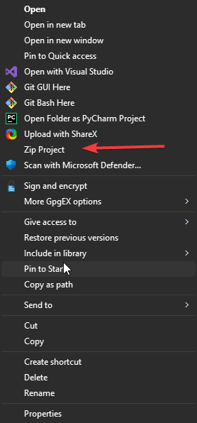

# Mia (Miu Remix)
> Ignore this project if you don't know what it is

## How to use

- [Download batch file](https://github.com/Azuyamat/mia/releases/download/1.1.0/mia.bat)
- Place it in a folder (not in your downloads)
- Run the batch file with administrator rights
- You can now delete the mia.bat if you'd like

### What did this do?

- Adds a registry value towards the `zip_proj.bat` file
- Creates the `zip_proj.bat` file which contains execution details for the `main.py` file
- Downloads the `main.py` file from this repository

## Where is the ZIP file?
The zip file should automatically pop up once it is created, if it doesn't it should be under the project directory.

## What does this look like?

> Note: Instead of `Zip Project` the name will appear as `Mia Zip`

